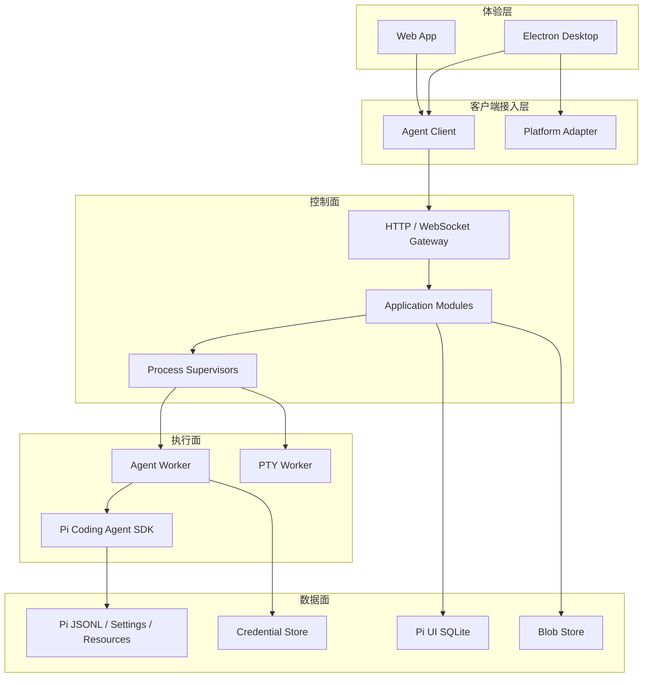

# Pi UI 后端宏观架构

> 当前实现已简化为 Server 进程内直接调用 Pi SDK，不再使用 Agent Worker、Supervisor、IPC 或存储租约。本文后续涉及 Worker 隔离的章节属于早期设计记录，以当前代码为准。

> 客户端接入也已简化为单一 Socket.IO WebSocket 连接；命令、ack 和流式事件共用该连接，不再提供 REST API 或原生 `ws` Gateway。

## 1. 架构目标

Pi UI 后端为 Web、Electron Desktop 和未来其他客户端提供统一的 Agent 工作台能力。
后端使用 `@earendil-works/pi-coding-agent` 作为 Agent 内核，在功能语义上覆盖 Pi TUI，
同时支持多客户端、可视化资源管理、终端、自动化和后续扩展。

宏观架构只固定长期边界，不在这里定义置顶、搜索、插件安装等单项功能的表结构和接口。

核心原则：

- 一套 React 应用连接同一套后台协议。
- Pi SDK 只在 Agent Worker 中运行。
- HTTP/WS 控制面保持模块化单体，不提前拆微服务。
- Pi Session JSONL 是会话内容的唯一真值。
- 后台公共协议不暴露 Pi SDK 内部类型。
- Agent 与 PTY 使用独立进程做故障隔离。
- 交互审批不等于安全沙箱，强权限必须由 OS/container 保证。
- 同一 Session JSONL 同一时刻只有一个可写 Runtime。

## 2. 系统分层



### 2.1 体验层

`apps/app` 是平台无关的 React 应用，负责界面、交互和临时客户端状态。Desktop 复用同一
应用，不创建第二套业务页面。

### 2.2 客户端接入层

`apps/app/src/agent` 封装 Socket.IO 连接、命令、重连和事件订阅。共享 DTO 位于
`packages/shared`。`packages/platform` 封装文件选择器、系统通知、外部链接等平台差异。

### 2.3 控制面

`apps/server` 是模块化单体，负责认证、协议、业务编排、进程监管和产品元数据。它不直接
运行 Pi SDK 或 `node-pty`，因此单个 Agent、插件或终端崩溃不会带走客户端连接。

### 2.4 执行面

`apps/agent-worker` 承载 Pi Runtime、工具和第三方插件。`apps/pty-worker` 承载交互 Shell。
两者都由控制面监管，只通过内部 IPC 通信，不向浏览器开放端口。

### 2.5 数据面

Pi 管理会话、设置和资源；Pi UI 管理工作台元数据、索引、任务和通知；附件和产物进入
Blob Store；模型凭据只存在后台 Credential Store。

## 3. 进程模型

```text
Desktop/Web Client
        |
        | HTTP + WebSocket
        v
Backend Control Plane
        |
        |-- AgentWorkerSupervisor -- Agent Worker -- Pi SDK
        |
        `-- PtyWorkerSupervisor --- PTY Worker --- User Shell
```

### 3.1 Control Plane

- 长生命周期进程。
- 持有 HTTP/WS 连接、模块服务、SQLite 和进程监管器。
- 不执行第三方插件代码。
- Desktop 模式默认监听随机 loopback 端口。

### 3.2 Agent Worker

- 稳定身份是 `runtimeSlotId`，不是 `sessionId`。
- Runtime 内可以发生 new/switch/fork/import 等 Session replacement。
- 默认隔离策略可配置为每活动 Runtime 一个 Worker。
- Worker 空闲时释放，从 Pi JSONL 恢复。
- 进程隔离是故障隔离，不是安全沙箱。

### 3.3 PTY Worker

- 管理 PTY 创建、输入、resize、signal 和关闭。
- 与 Pi 的一次性 `bash` tool 分离。
- 独立限制进程数、输出缓冲、cwd 和环境变量。

## 4. Monorepo 文件夹设计

```text
pi-ui/
├── apps/
│   ├── app/                         React 跨端应用
│   │   └── src/
│   │       ├── app/                 Provider、Router、应用启动
│   │       ├── features/            按业务功能组织页面与交互
│   │       ├── entities/            Workspace、Session、Message 等前端模型
│   │       ├── platform/            PlatformAdapter 接入
│   │       └── stores/              仅客户端状态
│   │
│   ├── desktop/                     Electron 壳
│   │   └── src/
│   │       ├── main/                窗口与 Backend 启停
│   │       ├── preload/             最小安全桥
│   │       └── renderer/            加载 apps/app
│   │
│   ├── server/                      Backend Control Plane
│   │   └── src/
│   │       ├── bootstrap/            配置、依赖组装、生命周期
│   │       ├── controller/           Socket.IO 接口、认证与响应
│   │       ├── service/              Runtime 业务逻辑
│   │       ├── core/                 错误、事件、锁、租约、操作日志
│   │       ├── modules/              业务模块
│   │       ├── supervisors/          Agent/PTY Worker 监管
│   │       ├── infrastructure/       SQLite、文件、Git、Blob 等适配器
│   │       └── observability/        日志、指标、诊断
│   │
│   ├── agent-worker/                Pi SDK 执行进程
│   │   └── src/
│   │       ├── runtime/              RuntimeSlot、SessionActor、replacement
│   │       ├── extension-ui/         Web Extension UI Bridge
│   │       ├── ipc/                  Worker 内部协议处理
│   │       └── main.ts               Worker 入口
│   │
│   └── pty-worker/                  PTY 执行进程
│       └── src/
│           ├── terminals/            PTY 生命周期
│           ├── ipc/                  PTY 内部协议处理
│           └── main.ts
│
├── packages/
│   ├── protocol/                    HTTP/WS/IPC schema 和 DTO
│   ├── agent-client/                跨端后台客户端
│   ├── pi-adapter/                  Pi SDK 创建、类型和事件映射
│   ├── platform/                    Web/Desktop 平台接口
│   ├── ui/                          共享 UI 组件和主题
│   └── shared/                      纯函数、常量、通用类型
│
└── docs/
    └── backend/
        ├── architecture-overview.md 宏观架构
        ├── feature-design-index.md  功能设计索引
        ├── features/                每个小功能独立设计
        └── adr/                     重要架构决策记录
```

## 5. Control Plane 模块设计

`apps/server/src/modules` 按业务能力组织。初期保持在一个进程和一个部署单元中，模块之间通过
明确 service interface 协作，不允许跨模块直接访问数据表。

```text
modules/
├── identity-access/       用户、设备、连接认证
├── workspaces/            工作区与路径授权
├── navigation/            置顶、最近、归档和侧栏元数据
├── sessions/              Session 目录、树、导入导出
├── runtimes/              Runtime 路由、状态与操作编排
├── permissions/           交互审批策略
├── project-trust/         项目资源信任，独立于工具权限
├── models/                Provider、模型、thinking、凭据状态
├── resources/             Package、Extension、Skill、Prompt、Theme
├── files/                 文件树、读取、写入、监听、附件
├── source-control/        Git、worktree 和 Pull Request
├── terminals/             PTY 会话的控制面
├── automations/           定时任务和 Run
├── search/                会话、消息、文件和命令索引
├── notifications/         通知和未读状态
├── settings/              用户、工作区和运行设置
└── audit/                 安全和变更审计
```

### 5.1 当前协调方式

`RuntimeService` 进程内维护 `runtimeSlotId` 到 Pi Runtime 的映射；SQLite Mapper 持久化 Session 元数据。
当前没有 Worker、租约、操作日志或事件补发层。

### 5.2 业务模块内部结构

每个模块保持一致但不过度分层：

```text
modules/sessions/
├── session-service.ts       用例编排
├── session-repository.ts    模块数据访问接口
├── session-policy.ts        业务规则
├── session-routes.ts        HTTP 接入
├── session-events.ts        对外事件
└── session-types.ts         模块内部类型
```

模块变大后再拆子目录，不为每个简单功能预建 domain/application/infrastructure 三层目录。

## 6. Agent Worker 模块设计

```text
agent-worker/src/
├── runtime/
│   ├── runtime-slot.ts
│   ├── session-actor.ts
│   ├── runtime-replacement.ts
│   ├── runtime-lifecycle.ts
│   └── event-subscription.ts
├── extension-ui/
│   ├── web-ui-context.ts
│   ├── pending-ui-requests.ts
│   └── editor-state-cache.ts
├── ipc/
│   ├── command-handler.ts
│   ├── event-publisher.ts
│   └── heartbeat.ts
└── main.ts
```

`apps/server/src/pi` 直接封装 Pi SDK Runtime、事件转换和 A2UI Tool。

Worker 宏观职责：

- 创建并持有 `AgentSessionRuntime`。
- 串行执行同一 Runtime 的 mutation。
- 转发 Pi event，不把 SDK 类型直接发送到外部。
- 处理 Session replacement 并报告新旧身份。
- 绑定 Extension UI Bridge。
- reload 后重新建立订阅和 Extension binding。
- 关闭时 abort、dispose 并执行扩展 shutdown。

## 7. Shared 与应用内实现

### 7.1 `packages/shared`

跨端共享类型的唯一来源：

- Runtime request、snapshot、event 和错误 DTO。
- A2UI Tool details DTO。
- Socket.IO 后端连接描述。
- 只包含可序列化 DTO，不依赖 Pi SDK、React 或 Electron。

### 7.2 `apps/app/src/agent`

- Socket.IO connection、重连和事件订阅。
- Runtime command result 和 snapshot 同步。
- 不保存业务真值，仅维护连接状态和客户端缓存。

### 7.3 `apps/server/src/pi`

- 创建 Pi Services 和 Runtime。
- Pi event 到共享 DTO 的映射。
- Pi message、tree、model、diagnostic DTO 转换。
- Pi 版本兼容处理。
- 不包含前端或传输层代码。

### 7.4 `packages/platform`

- Web 与 Desktop 平台接口。
- 原生文件选择器、系统通知、打开外链和应用信息。
- 不承载 Agent、Session、文件系统和 PTY 业务。

## 8. 数据归属

| 数据 | 真值 |
| --- | --- |
| 消息、工具调用、分支、compaction、Session 名称 | Pi JSONL |
| Pi settings、packages、models | Pi Agent 目录 |
| 工作区、置顶、归档、任务、通知、审计 | Pi UI SQLite |
| 搜索索引、标题缓存、缩略图 | 可重建派生数据 |
| Prompt 附件、导出和任务产物 | Blob Store |
| API Key、OAuth Token | 后台 Credential Store |
| 面板、滚动、草稿等显示状态 | React/Zustand |

后台不能另外建立第二套消息表。Session 名称等 Pi Session 信息可以进入 SQLite 缓存，但写入
必须通过拥有 Storage lease 的 Agent Worker 完成。

## 9. 宏观通信设计

### 9.1 HTTP

用于资源查询和管理操作，例如 Workspace、Session 目录、模型、插件、文件、计划任务和设置。

### 9.2 WebSocket

用于 Agent stream、tool event、steer/follow-up、权限请求、Extension UI、通知和 PTY 控制。

### 9.3 Internal IPC

用于 Control Plane 与 Agent/PTY Worker 通信。IPC 只在本机进程间存在，不作为公共 API。

外部和内部协议都必须支持版本、operation ID、stream cursor、server epoch 和结构化错误。
命令接收成功不代表执行完成；运行结果通过独立 operation result 表达。

## 10. 安全与可靠性边界

- `PermissionService` 提供交互审批，不能宣称阻止插件直接调用 Node API。
- 真正的 read-only/workspace-write 由 container、VM 或 OS sandbox 强制执行。
- 同一 Session 只能有一个 Storage lease 持有者。
- Worker 崩溃时运行中操作标记为 `uncertain`，不自动重放有副作用的命令。
- Session replacement 原子更新 Runtime 路由、Storage lease、客户端订阅和 controller lease。
- PTY、插件和 Agent stream 必须实施背压、配额、超时和资源回收。
- Desktop 默认 loopback + 临时 Token；远程部署使用 TLS、认证和 Host/Origin 校验。

## 11. 模块依赖规则

```text
apps/app
  -> agent-client / protocol / platform / ui / shared

apps/desktop
  -> app / platform / shared

apps/server
  -> protocol / shared
  -> infrastructure adapters

apps/agent-worker
  -> protocol / pi-adapter / shared

apps/pty-worker
  -> protocol / shared

pi-adapter
  -> pi-coding-agent
```

禁止依赖：

- `apps/app` 导入 Node、Electron、Pi SDK。
- `apps/server` 直接导入 React UI。
- 业务模块跨过 service interface 读取其他模块的数据表。
- `packages/shared` 依赖 Pi SDK 类型。
- Agent Worker 绕过 Control Plane 直接向浏览器通信。
- Control Plane 直接修改活动 Session JSONL。

## 12. 后续功能设计

宏观架构稳定后，每个功能单独建立文档，至少包含：范围、用户流程、状态模型、数据归属、
HTTP/WS 契约、权限、异常恢复、并发规则和验收测试。

建议设计顺序：

1. Runtime 与 Session 生命周期。
2. WebSocket 连接、操作和事件流。
3. Workspace 与路径授权。
4. 模型、Provider 和凭据。
5. 权限审批与 Project Trust。
6. 消息、分支、fork、compact 和恢复。
7. Package、Extension、Skill、Prompt 和 Theme。
8. 文件、附件和搜索。
9. PTY。
10. 置顶、最近、归档和侧栏同步。
11. Git、worktree 和 Pull Request。
12. 计划任务和通知。

功能设计不得改变本文件确定的进程边界、数据真值和依赖方向；确需修改时先增加 ADR。
