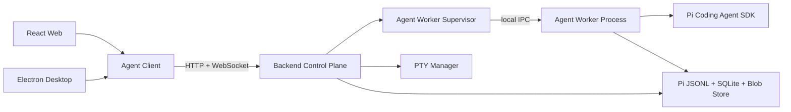

# Pi UI 后端架构

## 1. 目标

为 `pi-ui` 提供一套同时服务 Web、Electron Desktop 和未来移动端的后台。后台以
`@earendil-works/pi-coding-agent` 为 Agent 内核，实现 Pi TUI 的完整功能语义，并在此基础上
增加多客户端连接、可视化插件管理、PTY、任务调度、通知、Git/PR 和可扩展 Web UI 协议。

本架构追求的是功能对齐，而不是复用终端渲染代码：

- Pi SDK 负责 Agent、Session、工具、模型、插件和资源生命周期。
- 后台负责远程协议、运行时监管、安全边界、索引和产品级能力。
- React 负责把 TUI 的交互语义重新实现为 Web/Desktop 界面。
- TUI 专属组件无法直接渲染到浏览器时，使用标准 UI Bridge 或明确降级。

## 2. 核心决策

| 决策 | 选择 |
| --- | --- |
| Agent 内核 | `@earendil-works/pi-coding-agent` |
| Session 入口 | `createAgentSessionRuntime()` |
| 外部协议 | HTTP + WebSocket，版本化 JSON DTO |
| 会话真值 | Pi Session JSONL |
| 产品元数据 | SQLite |
| Agent 隔离 | 独立 Node.js Worker Process，由后台监管 |
| PTY | `node-pty`，独立于 Pi `bash` tool |
| 插件管理 | `DefaultPackageManager` + `SettingsManager` |
| 浏览器插件 UI | Extension UI Bridge + 声明式 Web Contribution |
| `pi-server` | 暂不作为核心；通过 adapter 保留未来替换能力 |
| `pi-server/legacy` | 不采用 |

不能把 SDK 对象、JSONL entry 或 Electron IPC 结构直接作为公共 API。所有外部数据必须经过
`packages/protocol` 中的稳定 DTO，以隔离 Pi 升级造成的类型和行为变化。

## 3. 部署拓扑



### 3.1 Desktop

Electron main 启动本地 Backend Control Plane，后台监听随机 `127.0.0.1` 端口并生成一次性
连接 Token。Renderer 仍是普通 Web Client，不直接导入 Node、Electron 或 Pi SDK。

```text
Electron main
  -> start backend
  -> receive { port, token }
  -> pass connection descriptor through preload
  -> React connects to HTTP/WS
```

Electron IPC 只保留窗口、原生菜单、系统通知、文件选择器、打开外部链接等平台能力。

### 3.2 Web

Web UI 连接部署在工作区所在机器上的 Backend。若要操作用户本机项目，必须安装本地
Companion Backend；云端 Backend 只能操作云端或已挂载的工作区。

### 3.3 Worker 隔离

每个活动 Session 默认使用独立 Worker Process。这样插件崩溃、内存泄漏或调用
`process.exit()` 时不会带走 HTTP/WS 控制面。Worker 空闲后可以释放，重新打开时从 Pi JSONL
恢复。未来可增加“每 Workspace 一个 Worker”的低开销策略，但不能改变外部协议。

## 4. Monorepo 结构

```text
apps/
  app/                         共享 React 应用
  desktop/                     Electron 壳
  server/                      Backend Control Plane
    src/
      bootstrap/
      http/
      websocket/
      auth/
      workspaces/
      sessions/
      agents/
      permissions/
      models/
      packages/
      files/
      git/
      pull-requests/
      pty/
      schedules/
      search/
      notifications/
      persistence/
      observability/
  agent-worker/                Pi SDK Worker Process
    src/
      runtime/
      sdk-adapter/
      extension-ui/
      ipc/
packages/
  protocol/                    HTTP/WS/IPC DTO、schema、版本
  agent-client/                Web/Desktop 共用客户端
  pi-adapter/                  Pi SDK 类型隔离与事件映射
  platform/                    Web/Desktop 平台能力
  shared/                      纯业务类型与工具
  ui/                          共享 UI
```

`apps/server` 和 `apps/agent-worker` 都要求 Node.js 22.19.0 或更高版本。`apps/app` 不得依赖
这两个包中的任何 Node 模块。

## 5. 后台模块

### 5.1 WorkspaceService

- 注册、校验、重命名、置顶和移除 Workspace。
- 保存真实路径、显示名、Git 根目录和默认模型策略。
- 维护允许访问的路径根，防止目录穿越和任意文件读取。
- 发现 `.pi` 配置、上下文文件、Skills、Prompts 和项目级 Packages。
- 监听工作区文件变化并向文件树、搜索索引和 Git 状态分发事件。

### 5.2 SessionService

- 列出、创建、打开、恢复、重命名、归档和删除 Session。
- 支持 `newSession`、`switchSession`、`fork`、`clone`、`navigateTree` 和 JSONL 导入。
- 读取 transcript、entry tree、labels、统计、成本和上下文使用量。
- HTML/JSONL 导出以及显式授权后的分享。
- 管理前端展示元数据，但不复制 Pi 消息内容。

### 5.3 AgentRuntimeService

- 通过 Supervisor 创建、监控和销毁 Worker。
- 一个 `SessionActor` 串行处理同一 Session 的状态变更命令。
- 将 Pi SDK event 映射为公共协议 event。
- 管理 prompt、steer、follow-up、abort、retry 和 compaction。
- Session 被替换或 reload 后重新绑定事件和 Extension UI Bridge。
- 保存短期事件 ring buffer，支持 WebSocket 断线补发。

### 5.4 ModelService

- Provider 列表、模型元数据、能力、价格和上下文窗口。
- API Key、OAuth login/logout、凭据状态和连接测试。
- 当前模型、scoped models、thinking level 和 transport 设置。
- 模型切换、循环选择和 Session 模型恢复失败诊断。
- 凭据只在后台和 Pi `ModelRuntime` 中存在，不进入前端持久化状态。

### 5.5 PermissionService

- 将 UI 中的“完全访问”等模式映射为明确策略，而不是一个布尔值。
- 对文件读写、Shell、网络、Git、插件安装、外部打开和凭据操作进行决策。
- 支持 allow once、allow session、allow workspace、deny。
- 处理 Extension `select/confirm/input/editor` 等阻塞请求。
- 为无人值守计划任务提供预先声明的非交互策略。
- 记录审批、拒绝、规则来源和执行结果。

建议权限模式：

```text
read-only       只读文件与只读 Git
workspace-write 仅允许授权 Workspace 内写入
full-access     允许本机工具，但高风险操作仍受 deny rule 约束
custom          用户定义 allow/ask/deny 规则
```

### 5.6 PackageService

- 使用 `DefaultPackageManager` 安装、更新、卸载和解析 package。
- 使用 `SettingsManager` 管理 global/project scope 和资源过滤。
- 管理 extension、skill、prompt、theme 四类资源。
- 返回版本、来源、manifest、安装路径、资源列表和诊断。
- 通过 WebSocket 推送下载、依赖安装、解析和 reload 进度。
- 安装或配置变化后，对相关活动 Session 执行安全的 `session.reload()`。
- 对相同 scope 的 package 变更加锁，避免并发损坏配置。

### 5.7 FileService

- 目录树、分页、模糊查找、内容读取、保存、创建、移动和删除。
- 文本、图片、音频、PDF、diff 等预览元数据。
- 文件 watcher、Git ignore 处理、大文件和二进制限制。
- Prompt 图片和附件上传到内容寻址 Blob Store。
- 所有路径在服务端 canonicalize 后再次做 Workspace 边界检查。

### 5.8 GitService 与 PullRequestService

- status、diff、log、branch、checkout、worktree、commit 和冲突状态。
- 对写操作复用 PermissionService。
- PR 列表、详情、checks、评论、创建和关联 Session。
- GitHub Token 由后台 Credential Store 管理。

### 5.9 PtyService

- 创建持久 PTY、输入、resize、signal、关闭和退出状态。
- 使用独立 `terminalId`，不能与 Agent 的一次性 `bash` tool 混为一体。
- 输出使用带序号的二进制或 UTF-8 WebSocket frame，并实施背压和最大缓冲限制。
- Session 可以引用 Terminal，但默认不把完整终端输出写入 Pi 上下文。

### 5.10 SchedulerService

- one-shot、cron、时区、启停、并发策略和失败重试。
- 每次运行创建独立 Run 与 Agent Worker，记录关联 Session。
- 无人值守任务禁止临时弹出权限框；未命中预授权规则时立即失败并通知。
- 支持超时、取消、运行日志、产物和用量预算。

### 5.11 SearchService

- 搜索 Workspace、Session、消息、文件、命令、Skill 和 Package。
- 监听 Pi JSONL 增量更新 SQLite FTS 索引。
- 搜索索引只是派生数据，可随时从 JSONL 和 Workspace 重建。
- 结果必须包含稳定定位信息，例如 `sessionId + entryId` 或 `workspaceId + path`。

### 5.12 NotificationService

- Agent 完成、失败、等待授权、计划任务结果和插件更新。
- 未读计数、已读、清除和客户端订阅。
- Desktop 可转发系统通知；Web 可接入浏览器 Notification API。

## 6. Agent Worker

Worker 内部使用完整 Runtime，而不是只创建一个最小 `AgentSession`：

```ts
const createRuntime: CreateAgentSessionRuntimeFactory = async ({
  cwd,
  sessionManager,
  sessionStartEvent,
}) => {
  const services = await createAgentSessionServices({ cwd });
  return {
    ...(await createAgentSessionFromServices({
      services,
      sessionManager,
      sessionStartEvent,
    })),
    services,
    diagnostics: services.diagnostics,
  };
};

const runtime = await createAgentSessionRuntime(createRuntime, {
  cwd,
  agentDir: getAgentDir(),
  sessionManager: SessionManager.create(cwd),
});
```

Worker 必须封装以下规则：

1. Runtime replacement 后，旧 `runtime.session` 引用立即失效。
2. 每次替换后重新 subscribe，并重新 `bindExtensions()`。
3. 同一 Session 的互斥命令必须串行执行；冲突命令返回明确错误。
4. prompt 的 ack 表示已接受，不表示运行已完成。
5. streaming delta 只实时转发，最终消息由 Pi 写入 JSONL。
6. Worker shutdown 前执行 abort、dispose 和扩展 shutdown hook。
7. Worker 崩溃后，控制面将 Session 标记为 interrupted，允许从 JSONL 恢复。

## 7. 数据归属

### 7.1 Pi 管理的数据

```text
~/.pi/agent/sessions/      Session JSONL
~/.pi/agent/settings.json  全局设置与 packages
~/.pi/agent/models.json    自定义模型配置
~/.pi/agent/auth.json      Pi Provider 凭据
~/.pi/agent/extensions/    全局扩展
~/.pi/agent/skills/        全局 Skills
~/.pi/agent/prompts/       全局 Prompts
~/.pi/agent/themes/        全局 Themes
```

消息、工具调用、compaction、branch、model change 和 extension entry 以 Pi JSONL 为唯一真值。

### 7.2 Pi UI 管理的数据

SQLite 建议包含：

```text
workspaces
workspace_preferences
session_metadata          pinned、archived、排序、UI title cache
session_search_index      可重建 FTS
schedules
schedule_runs
notifications
permission_rules
audit_events
package_install_jobs
client_devices
```

Blob Store 建议使用 `sha256` 内容寻址，保存 Prompt 附件、导出文件、任务产物和缩略图。
数据库只保存 hash、MIME、大小和引用关系。

### 7.3 前端本地状态

侧栏折叠、滚动位置、面板尺寸、编辑中的草稿、主题显示偏好和临时选中项保留在 React/Zustand。
服务端事实、Session 内容和 WebSocket 生命周期不能塞进全局持久化 store。

## 8. HTTP API

所有路由以 `/api/v1` 开头，响应包含稳定错误码，不把内部异常字符串直接暴露给客户端。

```text
GET/POST/PATCH/DELETE /workspaces
GET/POST/PATCH/DELETE /sessions
POST /sessions/:id/fork
POST /sessions/:id/clone
POST /sessions/:id/import
GET  /sessions/:id/transcript
GET  /sessions/:id/tree
GET  /sessions/:id/stats
POST /sessions/:id/export

GET  /models
PUT  /sessions/:id/model
PUT  /sessions/:id/thinking
GET/POST/DELETE /providers/:provider/credentials
POST /providers/:provider/test

GET/POST/PATCH/DELETE /packages
POST /packages/update
GET  /packages/jobs/:jobId
GET  /resources

GET/POST/PATCH/DELETE /files
POST /attachments
GET  /git/status
GET  /git/diff
POST /git/branches
GET/POST/PATCH /pull-requests

GET/POST/PATCH/DELETE /schedules
GET  /schedules/:id/runs
POST /schedules/:id/run
POST /schedules/:id/cancel

GET  /search
GET/PATCH/DELETE /notifications
GET/PATCH /settings
GET /health
GET /runtime-info
```

Session 的实时 mutation 走 WebSocket；HTTP 主要负责资源查询、配置和可重试的管理操作。

## 9. WebSocket 协议

### 9.1 Envelope

```ts
type ClientCommand = {
  v: 1;
  kind: "command";
  id: string;
  sessionId?: string;
  method: string;
  payload: unknown;
};

type ServerAck = {
  v: 1;
  kind: "ack";
  id: string;
  accepted: boolean;
  error?: ProtocolError;
};

type ServerEvent = {
  v: 1;
  kind: "event";
  seq: number;
  sessionId?: string;
  event: string;
  payload: unknown;
};
```

所有 schema 在 `packages/protocol` 中定义并在客户端和服务端运行时校验。`id` 用于幂等与
命令相关性，`seq` 用于断线补发。协议必须设置 frame、队列和附件大小上限。

### 9.2 Client commands

```text
connection.resume
session.attach / detach
session.prompt / steer / follow_up / abort
session.compact / abort_retry
session.set_model / set_thinking
session.set_steering_mode / set_follow_up_mode
session.reload
bash.execute / bash.abort
permission.respond
extension_ui.respond
pty.create / input / resize / signal / close
```

### 9.3 Server events

```text
connection.ready / replay_complete
session.snapshot / replaced / phase / info_changed
agent.start / turn_start / turn_end / settled / end
message.start / delta / end
thinking.delta
tool.start / update / end
queue.updated
compaction.start / end
retry.start / scheduled / attempt / end
bash.start / output / end
permission.request / resolved
extension_ui.request
extension.error
package.progress
pty.output / exit
notification.created
runtime.interrupted / recovered
```

重连时客户端提交每个订阅流最后收到的 `seq`。Ring buffer 尚存在时补发事件；否则发送新的
`session.snapshot`。前端不能依赖 delta 重建永久历史。

## 10. TUI 功能覆盖

| TUI 能力 | 后台实现 |
| --- | --- |
| `/login`、`/logout` | ModelService / Credential API |
| `/model`、模型循环 | ModelService + session model command |
| `/scoped-models` | Workspace/Session settings |
| `/settings` | Settings API，区分运行设置与纯 UI 设置 |
| `/resume`、`/new` | SessionService + Runtime replacement |
| `/name`、`/session` | Session metadata/stats API |
| `/tree` | Session tree DTO + navigate command |
| `/fork`、`/clone` | Runtime fork/clone |
| `/compact` | Session compact command/events |
| `/copy` | 前端能力，读取 last assistant text |
| `/export`、`/import` | Session export/import API |
| `/share` | 显式启用的 ShareService |
| `/reload` | PackageService + session reload |
| `/hotkeys` | 前端 Command Registry |
| `/changelog` | Runtime info/changelog API |
| `/quit` | Desktop 平台能力；Web 仅断开连接 |
| `!command` | Bash execution stream；交互 Shell 使用 PTY |
| 消息 steer/follow-up | WebSocket queue commands |
| 图片与附件 | Blob Store + Pi ImageContent |
| 自动 compaction/retry | Runtime settings + lifecycle events |
| Project trust | Workspace trust + PermissionService |
| Skills/Prompts | Resource API + command catalog |
| Extensions | PackageService + Extension Bridge |

## 11. Extension 兼容与增强

### 11.1 原生兼容

以下能力在 Worker 内直接由 Pi Extension Runtime 执行：

- lifecycle events
- `registerTool`、tool interception 和 custom tool
- `registerCommand`
- `sendMessage`、`sendUserMessage`、custom entries 和 labels
- active tools、model、thinking 和 provider registration
- Session replacement、compaction 和 reload
- extension state persistence

### 11.2 Standard UI Bridge

`select`、`confirm`、`input`、`editor` 为阻塞请求。Worker 生成 `requestId`，通过控制面和
WebSocket 发给当前 controller client，等待 `extension_ui.respond`。通知、status、widget、title
和 editor text 是 fire-and-forget event。

必须处理：

- 请求超时和默认值。
- controller 断开后的取消策略。
- 同一 Session 多客户端只能有一个 UI responder。
- reload/session replacement 后旧 UI request 失效。
- 前端必须将 Markdown/HTML 当作不可信输入进行净化。

### 11.3 TUI-only 降级

以下 API 返回 Pi TUI `Component` 或依赖终端输入，无法自动跨端：

- `ctx.ui.custom()`
- custom editor/header/footer component factory
- terminal-only theme/component renderer
- TUI shortcut handler

后台必须返回 capability diagnostic，而不是静默假装成功。插件详情页展示兼容级别：

```text
headless-compatible
web-standard-ui
tui-only-degraded
web-enhanced
```

### 11.4 Web Extension Contribution

为实现“甚至扩展”，Pi UI 增加可选声明式 manifest：

```json
{
  "pi": {
    "web": {
      "commands": [],
      "settings": [],
      "messageRenderers": [],
      "panels": []
    }
  }
}
```

第一层只允许 JSON Schema 表单、命令、状态项和受控 Markdown renderer。确需自定义代码的
插件在 sandboxed iframe 中运行，通过受限 postMessage SDK 通信，不能把第三方 React 代码
加载进主应用上下文，也不能直接访问 Token、文件系统或宿主 DOM。

## 12. 并发和所有权

- 一个 Session 可以有多个 observer client，但同一时刻只有一个 controller lease。
- controller 可以发送 mutation 和响应 UI/permission；observer 只能读取和订阅。
- 同一 Session 的 mutation 进入 `SessionActor` mailbox。
- prompt 运行期间，只允许 abort、steer、follow-up 和明确标注为并发安全的查询。
- package、settings 和 workspace write 使用 scope lock。
- 每条 command 都有 idempotency key，重连重发不会重复执行。
- Scheduler 使用独立 owner，不抢占正在交互的 Session。

## 13. 安全边界

- Backend 默认只绑定 loopback；远程部署必须使用 TLS、认证和 Origin/Host 校验。
- Desktop 使用短生命周期 bootstrap token，再换取连接 session token。
- 路径先 `realpath`，再检查是否位于授权 Workspace root。
- 禁止将凭据、环境变量和完整内部错误回传前端。
- 插件属于可执行代码，安装前显示来源、版本、签名/产地、资源和风险提示。
- Package install、Git source 和依赖安装必须限制超时、输出和并发。
- Worker 继承最小环境变量；远程多租户场景需要 OS/container 级隔离，不能只依赖 Node 进程。
- Web renderer 使用 CSP，插件 iframe 使用独立 origin 和 sandbox flags。
- 文件、命令、权限、插件和凭据变更写入 append-only audit log。

## 14. 可靠性

- 控制面启动时清理失效 Worker，并扫描未正常结束的运行。
- Session JSONL 写入由 Pi 管理，不额外逐 delta 落库。
- SQLite 使用 WAL、migration 和定期 checkpoint。
- Worker 定期发送 heartbeat；超时后 supervisor 终止并标记 interrupted。
- WebSocket 对慢客户端实施背压，超过阈值断开并要求 snapshot 重连。
- package install 使用 job 状态机：queued、running、succeeded、failed、cancelled。
- Scheduler 使用租约防止同一任务重复运行。
- 搜索索引、缩略图和事件 ring buffer 都是可丢弃派生数据。

## 15. 可观测性

结构化日志至少包含：

```text
requestId
connectionId
clientId
workspaceId
sessionId
workerId
runId
commandId
packageJobId
```

指标至少覆盖 Worker 数、活动 Session、首 token 时间、运行时长、工具耗时、重连次数、事件
积压、PTY 缓冲、Package 安装失败、模型错误、Token 和成本。日志默认脱敏 Prompt、凭据和文件
内容，诊断导出必须让用户预览。

## 16. 测试与验收

### 16.1 测试层级

- Protocol schema 与兼容性测试。
- Pi Adapter contract tests，覆盖升级前后事件映射。
- Session JSONL fixture 和树导航测试。
- Worker crash/restart/reload 测试。
- WebSocket ack、幂等、断线补发和慢客户端测试。
- Extension UI request/response、超时和降级测试。
- 路径穿越、symlink escape、权限和插件安装安全测试。
- PTY 输入、resize、退出和背压测试。
- Scheduler 重复触发和恢复测试。
- Web/Desktop 使用同一套端到端协议测试。

### 16.2 完整能力验收

完成标准不是“能聊天”，而是以下流程全部通过：

1. 创建、运行、关闭后台后恢复 Session，消息和分支一致。
2. streaming 中 steer、follow-up、abort 和 retry 状态正确。
3. 模型、thinking、active tools 和设置可动态切换并持久化。
4. tree、fork、clone、compact、import、export 全流程可用。
5. 插件安装后无需重启应用即可 reload，并能注册工具、命令和标准 UI。
6. TUI-only 插件能力有清晰诊断和降级，不造成 Session 死锁。
7. PTY 与 Agent bash 同时运行且互不污染。
8. Desktop 与 Web 连接同一 Backend 时状态一致，多客户端所有权明确。
9. Worker 崩溃不影响控制面，Session 可以恢复。
10. 权限、路径、凭据和插件执行通过安全测试。

## 17. 实施顺序

这不是缩减范围的 MVP 列表，而是完整架构的依赖顺序：

1. `protocol`、Control Plane、Worker Supervisor、Pi Adapter。
2. Session/Agent Runtime、WebSocket event stream、恢复与幂等。
3. Model/Auth、Permission、Workspace/File、附件。
4. Package/Resource、Extension UI Bridge、reload 和诊断。
5. Session tree/fork/clone/compact/import/export/search。
6. PTY、Git/worktree/PR、Scheduler、Notification。
7. Web Extension Contribution、iframe sandbox 和远程多客户端强化。

每一阶段都使用最终模块边界和协议，不创建后续必须推倒的临时会话格式或临时 RPC。

## 18. 最终边界

```text
Pi SDK             负责 Agent 和 Session 语义
Agent Worker       负责 SDK 生命周期和插件隔离
Backend Control    负责协议、监管、安全和产品服务
Pi JSONL           负责会话真值
SQLite/Blob Store  负责产品元数据、索引、任务和产物
React              负责跨端交互和渲染
Electron           负责桌面壳与少量原生平台能力
```

该边界可以完整覆盖 TUI 的功能语义，也允许在不污染 Pi Session 内核的情况下继续扩展插件
市场、Web 组件、计划任务、远程工作区、多客户端协作和企业级安全能力。
